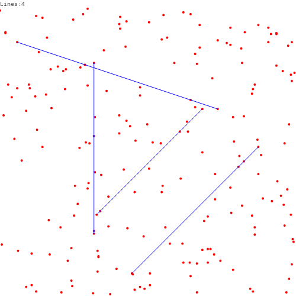
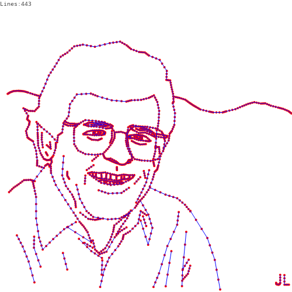

# 查找四个（以及以上）的共线的点

这是coursera课上《算法》中的一道练习题。题目大意是从一堆点里面查找出所有的4个以及4个以上的共线的点。

数据文件的格式：

第一行为点的个数以及文件的名字。后面每个非空行为一个点，为空格拆分的两个数值，第一个为x坐标，第二个为y坐标。
程序输出图片，图片中绘制点，以及找到的线段。

例如:

input200.txt 的结果:



rs1423.txt的结果:



## 运行

```sh
deno run --allow-write main.ts < data/input200.txt
```

> 为什么用deno来做这个练习？

因为Deno有着开箱即用的typescript支持。

## 解

### 四点共线的判断

对于a,b,c,d四个不同的点，线段ab,ac,ad,的斜率分别为s1,s2,s3，先假设这些斜率存在。 如果s1 == s2 并且 s1 == s3 ，则这四个点共线。因为三条线段的斜率相同，那么这三条线段是平行的，又因为这三条线段有一个公共的a点，那么这三条线段是共线的。

计算斜率:
```typescript
function slope(p0: Point, p1: Point): number {
  const [x0, y0] = p0;
  const [x1, y1] = p1;
  if (x0 - x1 === 0) {
    return Number.POSITIVE_INFINITY;
  }
  return (y1 - y0) / (x1 - x0);
}
```
这里将垂直的线段的斜率定义为正无穷，这样在判定4点是否共线的时候就不需要额外的处理垂直的情况，而可以统一的处理。

### 合并线段

**合并两条线段**

找出组成这两条线段的4个点最上端和最下端的点即可，在y相同时，找出最左和最右的端点即可。可以将点的大小定位为:
```typescript
function comparePoint(p0: Point, p1: Point): number {
  const [x0, y0] = p0;
  const [x1, y1] = p1;
  if (x0 === x1 && y0 === y1) {
    return 0;
  }
  if (y0 < y1 || (y0 === y1 && x0 < x1)) {
    return -1;
  }
  return 1;
}
```
y不同时y大的点大，y相同时x大的点大。这样，找出四个点中的最大和最小点即可。

**合并多条线段**

见mergeSegments

### 暴力搜索

遍历所有每四个点的组合，判断每个组合中的四个点是否共线，如果共线，则将这四个点组成的线段的两个端点记录下来，最后将所有的所有线段**合并**起来，便得到了所有的结果。

四个以上的点共线是会处理到吗？会，因为遍历了所有4个点的组合，对于4个以上的点共线的情况，会得所有点的组合生成的线段，这些线段会在组合阶段组合成一个线段。

因为要遍历所有的四个点的组合，而对于每四个点的组合的处理过程与问题的规模n没有关系。所以暴力搜索的时间复杂度为O(n^4)。

### 按斜率排序

对于每个点P，计算它与其它各点的斜率，再将这些斜率排序。结果中所有3个以及3个以上的相等的斜率对应的点与P点共线。

例如:
```
其它点:    p1,p2,p3,p4,p5,p6,p7,p8,p9
与P的斜率: a ,a ,a ,b, b, c ,c ,c ,c
```
则P,p1,p2,p3共线，P p4,p5共线 P,p6,p7,p8,p9共线。其中第二组只有三个点，不满足题目的要求，舍掉。

**时间复杂度**

计算每个点与其它点的时间复杂度为O(n^2), 此外还有对斜率的排序，以及排序后的处理，总的来说大致为：

n^2 + n*nlog(n) + n

所以时间复杂度大致为O(n^2logn)

相对与暴力收缩有了不小的提升。

### 更进一步

对于每个点，我们在乎的并不是所有斜率的完整的顺序，只要找到所有一样的斜率就行。因此，对所有斜率做一次完整的排序其实是一种浪费。
```typescript
function mapBasedSearch(points: readonly Point[]) {
  const lines: LineSegment[] = [];
  for (let i = 0; i < points.length; i++) {
    const p = points[i];
    // 搜集相同斜率对应的点
    const slopes = new Map<number, Point[]>();
    for (let j = i + 1; j < points.length; j++) {
      const q = points[j];
      const s = slope(p, q);
      if (slopes.has(s)) {
        slopes.get(s)?.push(q);
      } else {
        slopes.set(s, [q]);
      }
    }
    for (const ps of slopes.values()) {
      if (ps.length >= 3) {
        ps.push(p);
        
        ps.sort(comparePoint);
        lines.push([ps[0], ps[ps.length - 1]]);
      }
    }
  }
  return mergeLineSegments(lines);
}
```
时间复杂度为O(n^2*S(n'))。S(n') 为操纵Map的时间复杂度，[ES规范](https://262.ecma-international.org/6.0/#sec-map-objects)规定这是一个和Map元素数量成亚线性关系（Sublinear)。这里具体不太好分析，但是实践表明相对前一种方法还是要快不少。

